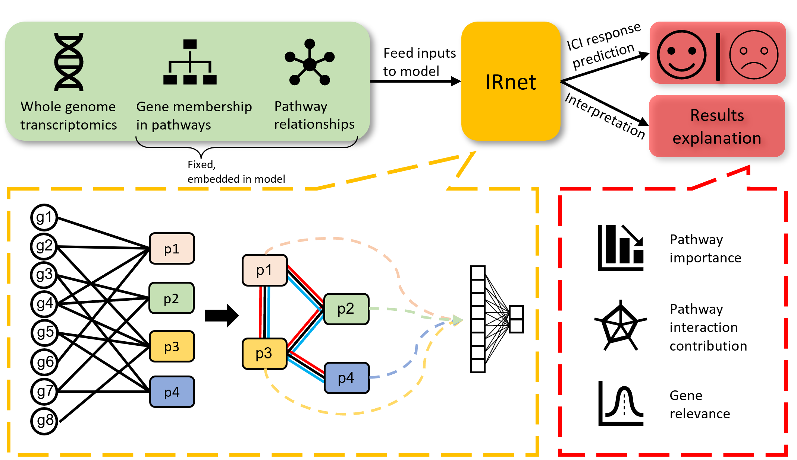

# IRnet
Immunotherapy response prediction using pathway knowledge-informed graph neural network
## Overview
In this work we present PromptProtein, a structural-enhanced protein language model that jointly optimize the MLM, CRD, and PPI objectives, which bring excellent improvements to a wide range of protein tasks.


## Installation
- Anaconda3 required (tested on version 4.12.0)
- Download and unzip this GitHub repo.
- Create the conda environment for IRnet
```sehll
$ conda env create -f IRnet_env.yaml 
```
## Usage

### Run IRnet through command line:

```
usage: predict.py [-h] -input INPUTFILE -output OUTPUTDIR -treatment DRUG

IRnet: Immunotherapy response prediction using pathway knowledge-informed
graph neural network

optional arguments:
  -h, --help         show this help message and exit
  -input INPUTFILE   Gene expression matrix with values separated by Tab. Rows
                     are named with gene symbols. Columns are named with
                     patient IDs. (default: None)
  -output OUTPUTDIR  The name of the output directory. (default: None)
  -treatment DRUG    Specify the immunotherapy treatment target, either "anti-
                     PD1", "anti-PDL1", or "anti-CTLA4" (default: None)
```

#### Example

The file `example_expression.txt` contains the gene counts separated by tabs. Rows are named with gene symbols. Columns are named with patient IDs. User provided gene expression input should follow this format, the order of genes doesn't matter.
To obtain the anti-PD1 immunotherapy response prediction for this dataset, you can run following code on your terminal:

```shell
$ python ./predict.py -input ./example_expression.txt -output ./prediction_results/ -treatment anti-PD1
```

The output file `prediction_results.txt` will be created under the fold `./prediction_results/`. It has three columns: Patient ID, Predicted score, and Predicted Immune Checkpoint Inhibitors (ICI) response.

```
Patient ID	Predicted score	Predicted ICI response
Patient107	0.3977815508842468	False
Patient163	0.31186426132917405	False
Patient96	0.4907291173934937	False
Patient83	0.5010034710168838	True
Patient121	0.6585307002067566	True
Patient48	0.3147367350757122	False
Patient94	0.6644996523857116	True
Patient117	0.539155526459217	True
```
## Citation

-  
